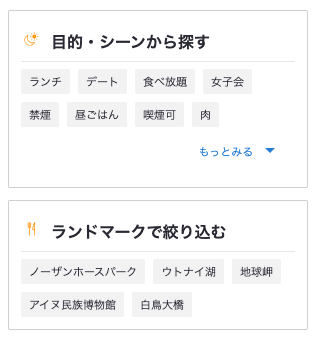

# アンチパターン

このページでは、設計・実装におけるアンチパターン（NG集）を紹介します。

## クラスの命名

### 文脈に依存したクラス名

クラス名は、なるべく**文脈から独立**した、部品としての特徴を捉えた名称にすべきです。

文脈とは「**どこで何のために使われているか、何が入っているか**」です。文脈を元にクラスを付与すると、再利用性が損なわれます。以下は好ましくない例です。

```html
<button class="button-submit">送信する</button>

<table class="news-list-table">...</table>
<table class="table is-news-list">...</table>
```

たとえば一つ目のボタンの例だと、クラス名（`-submit`）が「送信する」という役割に依存しています。そのため、同じ見た目で「送信」ではない役割を持ったボタンには使い回しづらくなっています。

二つ目は、ニュースの一覧を表現するテーブルの例です。ここではクラス名が内容物に依存しています。そのため、ニュース以外のコンテンツが入った同じ見た目のテーブルには再利用できません。

コンポーネントは**視覚的な抽象結果**であって、どこでどのように使われるか、という文脈からは独立しているべきです。あくまで視覚的な特徴からクラスを命名します。

```html
<button class="button is-primary">送信する</button>

<table class="table is-striped">...</table>
```

いくつか実例で見ていきましょう。

下記は、上下どちらもタグ（灰色背景）が並んでいます。見た目は同じですが、意味は異なります。上は「ランチ」「デート」など目的を表していますが、下は「地球岬」など場所を表しています。



上側のケースに引っ張られて `.purpose-tag`（目的タグ）などと命名すると、下側のケースには適さなくなってしまいますね。

続いて、画像を用いたリンクリストの例です。デザインパーツとしては同一と見なせますが、上は「料理ジャンル」のために使われ、下は「利用シーン」のために使われます。こちらも `.category-list` などと命名すると、下側のケースに適さなくなります。


ただし、コンポーネントには**汎用的であるべき**ものと**特殊でも構わない**ものの2種類があります。

たとえば以下の例を見てみましょう。


この一つ一つのカード状のコンポーネントを、`.card` などと汎用化する必要があるでしょうか？言い換えると、**中身が変わって、別の意味で使われそうでしょうか？**

私であれば、その可能性は低いと判断して `.user-card` のような名前にすると思います。

このように、それぞれのコンポーネントが汎用的な入れ物になり得るのか？どれだけ汎用的に振る舞わせるか？、というのが、設計判断のポイントになります。

設計時点での仕様のみを頼りにしすぎないように注意しましょう。「料理ジャンル」と「利用シーン」の例だと、初期の仕様では「利用シーン」は存在しなかったかもしれません。

### 色名などをクラス名に用いる

バリエーションクラスに、具体的な属性値をそのまま用いると、変更に弱くなります。

```html
<!-- NG -->
<button clsss="button is-red">ボタン</button>
<button clsss="button is-gray">ボタン</button>
```

上記を例にすると、サイト内で使用するボタンの色が赤ではなくなった場合、HTML と CSS の両方の修正が発生するため、メンテナンス性が低いコードとなります。

クラス名はできるだけ抽象的な意味・役割をもとに命名します。

```html
<!-- OK -->
<button clsss="button is-primary">ボタン</button>
<button clsss="button is-disabled">ボタン</button>
```

「なぜ赤なのか？」を考えて、それを名前にするということです。

以下の例は、さらに分かりやすい NG 例ではないでしょうか。

```html
<!-- NG -->
<button clsss="button is-fontsize-12px">ボタン</button>
```

具体的な属性値は CSS で決めるべきで、HTML 側のクラス名には役割を名前として与えます。

```html
<!-- OK -->
<button clsss="button is-small">ボタン</button>
```

こうすることで、なるべく HTML/CSS の結合を緩くします。

### 略語をクラス名に用いる

```html
<button class="tgt">...</button>
```

略語によって得られる利益はありません。何の略なのか？と考える余計な時間が発生するのみです。

もし単語を短くしたいなら、略するのではなく、同じ意味の別の単語を探しましょう。

## 実装

### 要素へ直接スタイルを当てる

```css
.card span {
  /* NG! */
}
```

HTML 要素へ直接スタイルを当てると、特定の HTML 構造でしか成立しない固定的な、将来の変更に対し脆弱なスタイルとなります。

たとえば、コンポーネント内に要素を追加しにくくなります。上の例で言うと、`.card` の中にもう一つ `<span>` 要素が必要になったときに不要なスタイルが適用されますね。

クラスに対して、スタイルを定義しましょう。

```css
.box .box-text {
  /* OK */
}
```

ただし、例外もあります。まず、`body` 要素などへの基本的なスタイルやリセットスタイルでは、要素に直接スタイルを定義します。

```css
body {
  font-family: ...;
}

ul {
  list-style: none;
}
```

もう一つの例外は、HTML の仕様上、またはコンポーネントの仕様上、必ず特定の要素しか配置されない場合です。

```html
<!-- HTMLの仕様 -->
<figure class="avatar-image">
  <!-- figureの下には必ずimgが入る -->
</figure>

<!-- コンポーネントの仕様 -->
<li class="link-list-item">
  <a href="#">...</a><!-- ここにはリンクしか入らない想定である -->
</li>
```

```css
.link-list-item a {
  /* ... */
}

.avatar-image img {
  /* ... */
}
```

### セレクタを駆使する

```css
.box > p + p {
  /* NG! */
}
```

セレクタを駆使すればするほど、柔軟性に欠ける記述になります。HTML 構造の位置関係を CSS 側から強制するからです。

なるべくクラスに対してスタイルを定義します。

### 詳細度に頼る

CSS には、[詳細度](https://developer.mozilla.org/ja/docs/Web/CSS/Specificity)という重要な言語仕様があります。

詳細度は、デバッグには必要な知識ですが、実装時にはそこまで意識することはないはずです。詳細度に頼りすぎたスタイル定義は変更に対して脆く、予測困難で、すぐに壊れます。

詳細度を細かく調節したくなったら、一度立ち止まりましょう。「そもそもなぜ細かい詳細度の調節が必要になっているのか？」という根本的な問題について検討したほうが健全な場合が多いです。

### `!important` を濫用する

```css
.box {
  background-color: tomato !important; /* NG! */
}
```

`!important` の使用は、つまり詳細度の調節です。さらに、他のスタイルとの協調を阻害します。一部のユーティリティクラスを除き、使用しません。

```css
/* これは許容される例 */
.hidden {
  display: none !important;
}
```

### 過度なネスト（Scss）

```scss
.one {
  .two {
    .three {
      .four {
        .five {
          // ...
        }
      }
    }
  }
}
```

Sass はネストが文法的な特徴であり、便利ですが、過度なネストはまず単純に可読性に欠け、しかも不必要です。そして場合によってコンポーネントの独立性を阻害します。

ネストする機能的、意味的な理由がある場合にのみ、ネストします。

```scss
.component {
  .is-aaa {
    // ...
  }

  .is-bbb {
    // ...
  }

  .component-child {
    // ...
  }
}
```

## 参考

- [エンジニアが受け取って困るCSS](https://www.hypertextcandy.com/troublesome-css-styles-for-developers)
