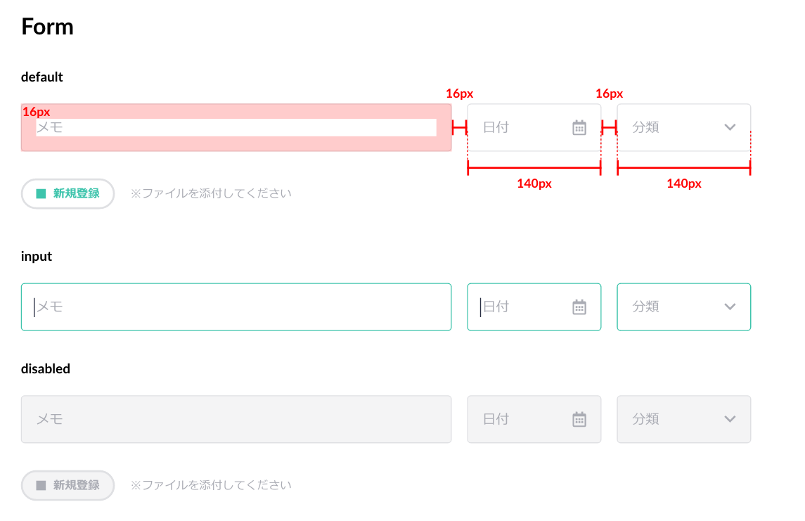
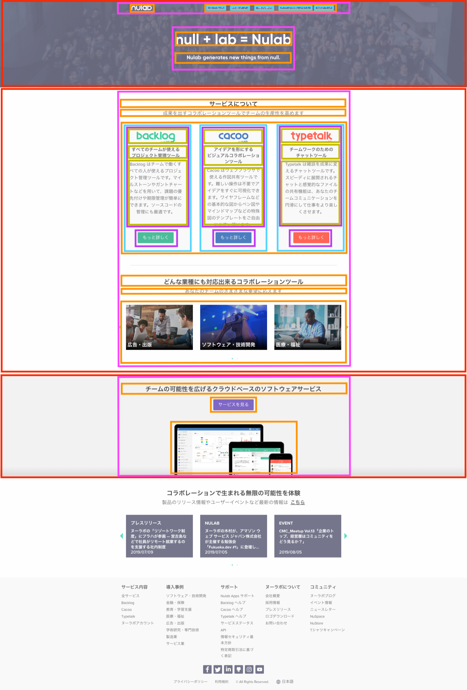

# 開発フロー

## 設計

### スタイルガイドを作成してもらう

まず、コンポーネント抽出の前提として、デザイナーにスタイルガイドを作成してもらいます。

スタイルガイドとは、ページごとの見た目とは別に、マージンやフォントサイズ、色のルール、各状態やコンテンツ量による見た目の変化などをまとめた資料です。



基本的にはデザイナーが作成しますが、エンジニアも積極的に関与します。後段のコンポーネント抽出や実装の段階で認識齟齬や漏れが出ないよう、以下の内容などを確認しましょう[^1]。

[^1]: 開発フローの標準としてスタイルガイドは作成することとしますが、プロジェクトによってどうしても作成できない場合でも、紹介したチェックポイントは確認しておきましょう。

- TODO
- TODO
- TODO

### コンポーネントを抽出する

スタイルガイドの情報をもとに、コンポーネントを抽出していきます。

デザインファイル全体を見渡して、視覚的な抽象化を行います。つまり、デザインファイル全体から特定の同一性をもつ部分を、コンポーネントとして切り出します。ページを判断基準にしてはいけません。複数のページに通底する規則性を見い出し、コンポーネントとして名前をつけていきます。

とはいえ、スタイルガイドができていれば、ある程度そちらに沿って抽出は行えるでしょう。

ただし、コンポーネントを抽出するのは、あくまでエンジニアの役割です。成果物は HTML や CSS ですから、デザイン意図を慎重に汲んだうえで、CSS を熟知した人間が最終的な責任を持ちます。

実装フェーズのインプットとして、コンポーネントごとに、以下の項目をまとめます。

- 共通仕様（最小幅やコンテンツ量が多いときどうなる、など）
- レスポンシブ仕様
  - デスクトップのみ
  - デスクトップ + タブレット
  - タブレットのみ
  - タブレット + モバイル
  - モバイルのみ
- バリエーションクラスの洗い出し
  - サイズ（`.is-small`, `is-large` など）
  - 色（`.is-primary`, `is-secondary` など）
  - etc.
- 個別のスタイルが必要な状態
  - hover
  - focus
  - etc.

## 実装

### 箱に分解する

コンポーネントごとに、箱で区切っていきます。この箱が、HTML の要素となる単位です。

イメージ図：



### 箱の種類を決める

箱を分けたら、その箱の種類、つまり HTML 要素を決めます。箱それぞれの役割や意味を考慮し、適切な要素を使用します。

```html
<article>
  <figure>
    
  </figure>
  <div>
    <h2></h2>
  </div>
  <div>
    <p></p>
  </div>
</article>
```

### 箱に名前を付ける

箱の種類（HTML 構造）が決まったら、箱に名前をつけます。つまり、クラス名を付与します。

```html
<article class="card">
  <figure class="card-image">
    
  </figure>
  <div class="card-header">
    <h2 class="card-title">三位一体開発</h2>
  </div>
  <div class="card-body">
    <p class="card-description">
      プロデューサー、デザイナー、エンジニアの三位一体開発により、 
      ワンストップで事業部門のニーズへの迅速な対応とコスト削減を実現します。
    </p>
  </div>
</article>
```

クラス名＝コンポーネント名、つまりサイト内で使い回す部品としての名称となります。

設計の段階で、コンポーネント名およびそれに付与されるバリエーションクラスが考えられているはずなので、内部のサブコンポーネントを命名していくことが主な作業内容となるでしょう。

詳しくは「[クラスの命名ルール](/css/css-class-naming-example)」ページを確認してください。

### スタイルを記述する

コンポーネントごとに、装飾を加えていきます。

ポイントは、スタイルの記述は、目的に大きく2種類あるということです。「**箱そのものを装飾する記述**」と「**箱と箱の関係性を表現する記述**」です。この2つの役割を1つのクラスに混ぜると、厄介なことになるので、区別して扱いましょう。

「箱そのものを装飾する記述」は、線を引いたり、背景色をつけたりです。多少テクニックが必要なこともあるかもしれませんが、「線は1pxで緑」「内側の余白は16px」と一つ一つ見ていけば、難しくないはずです。なので、必要な表現を洗い出して、コツコツ書いていきましょう。

「箱と箱の関係性を表現する記述」とは、2個以上の箱がどう並ぶか、です。どれだけ離れているか、どことどこが揃っているか、などです。Float, Flexbox, CSS Grid などのテクニックが必要になります。

注意点は、XD などのデザインには現れない、明示的には記述されないデザイン意図もある、ということです。どこが固定幅でどこが可変幅であるべきか？どの辺とどの辺が揃うべきなのか？など、想像力を働かせながら、デザイナーに確認を取りながら進めます。
